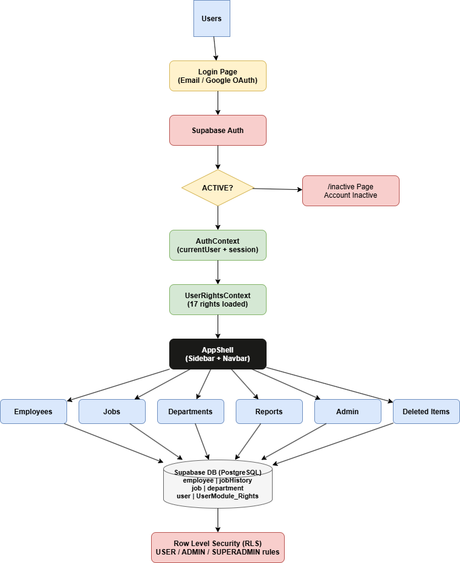
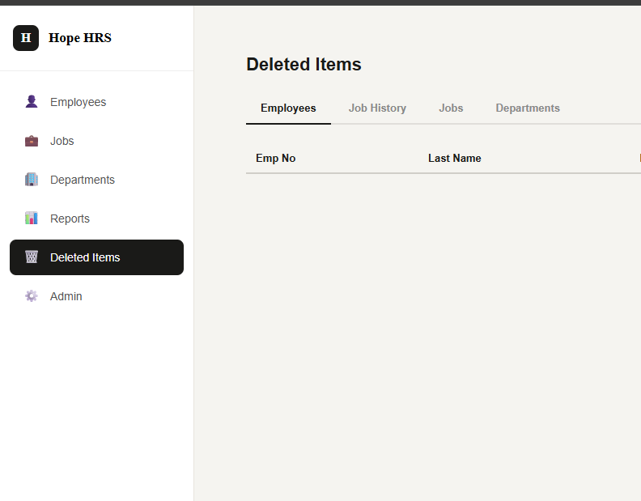
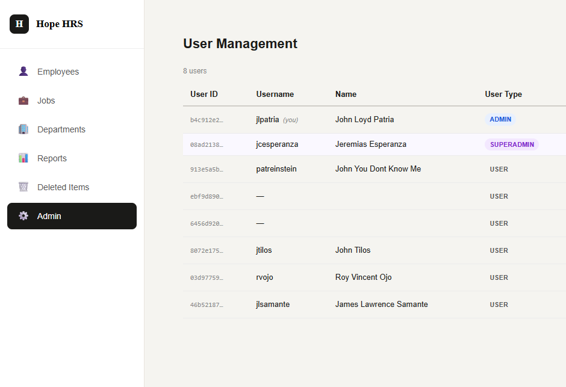
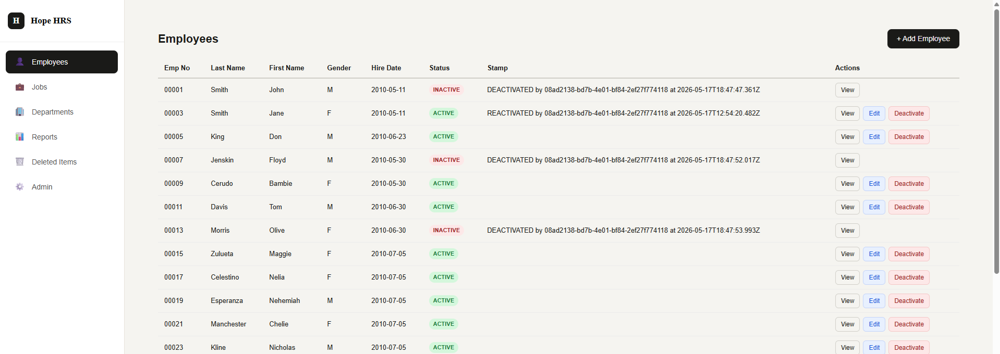

# Hope HRS — Presentation Slides
Group 5 | New Era University | AY 2025–2026

---

## Slide 1: System Overview
**Hope Human Resource System (HRS)**
- Built for Hope, Inc. to manage employee records digitally
- Replaces manual HR processes
- 3 user roles: USER, ADMIN, SUPERADMIN
- Tech stack: React + Vite, Supabase (PostgreSQL), React Router

---

## Slide 2: Architecture
**System Architecture**
- Frontend: React 18 + Vite, hosted on Vercel/Netlify
- Backend: Supabase (PostgreSQL + Auth + RLS)
- Authentication: Email/password + Google OAuth
- Authorization: 17-right UserModule_Rights system
- Database: 8 tables, 3 SQL views, 2 triggers

---

## Slide 3: Demo Flow
**Application Flow**
1. User registers (email or Google)
2. Admin activates the account
3. User logs in → redirected to /employees
4. User browses employees, jobs, departments, reports
5. Admin manages records (add/edit/deactivate/recover)
6. SUPERADMIN oversees all users and data

---

## Slide 4: Rights Matrix
**17-Right Permission System**

| Right | USER | ADMIN | SUPERADMIN |
|-------|------|-------|------------|
| EMP_VIEW | ✓ | ✓ | ✓ |
| EMP_ADD | ✗ | ✓ | ✓ |
| EMP_EDIT | ✗ | ✓ | ✓ |
| EMP_DEL | ✗ | ✓ | ✓ |
| JH_VIEW | ✓ | ✓ | ✓ |
| JH_ADD | ✗ | ✓ | ✓ |
| JH_EDIT | ✗ | ✓ | ✓ |
| JH_DEL | ✗ | ✓ | ✓ |
| JOB_VIEW | ✓ | ✓ | ✓ |
| JOB_ADD | ✗ | ✓ | ✓ |
| JOB_EDIT | ✗ | ✓ | ✓ |
| JOB_DEL | ✗ | ✓ | ✓ |
| DEPT_VIEW | ✓ | ✓ | ✓ |
| DEPT_ADD | ✗ | ✓ | ✓ |
| DEPT_EDIT | ✗ | ✓ | ✓ |
| DEPT_DEL | ✗ | ✓ | ✓ |
| ADM_USER | ✗ | ✓ | ✓ |

---

## Slide 5: Cascade Soft Delete
**Cascade Soft Delete Behavior**
- No hard deletes anywhere in the system
- Deactivating an employee → all their job history rows also set to INACTIVE
- Recovering an employee → all their job history rows restored to ACTIVE
- Implemented via PostgreSQL trigger on the employee table
- ADMIN/SUPERADMIN can view and recover deleted records in /deleted-items

---

## Slide 6: Reports
**HR Reports Module**
- Headcount by Department — active employee count per department
- Salary Summary by Job — MIN / MAX / AVG salary per job code
- Employee Full History — complete chronological job history per employee
- Built on SQL views in Supabase for performance

---

## Slide 7: Admin Module
**User Management (ADMIN/SUPERADMIN)**
- View all registered users with their type and status
- Activate newly registered users
- Deactivate users to revoke access
- SUPERADMIN rows are fully protected — cannot be modified by anyone

---

## Slide 8: SUPERADMIN Protection
**SUPERADMIN Guard**
- UI level: Activate/Deactivate buttons disabled on SUPERADMIN rows
- DB level: RLS policy blocks any UPDATE on SUPERADMIN rows
- Applies to both user table and UserModule_Rights table
- Prevents accidental or malicious privilege escalation

---

## Slide 9: Authentication Flow
**Login Guard**
- Email/password and Google OAuth both supported
- On every sign-in, system checks record_status in public.user table
- ACTIVE → redirected to /employees
- INACTIVE → signed out, redirected to /inactive page
- New registrations are provisioned automatically via PostgreSQL trigger

---

## Slide 10: Database Design
**Database Tables**
- employee, jobHistory, job, department — core HR data
- user, UserModule_Rights, user_module, rights, Module — auth & rights
- record_status (ACTIVE/INACTIVE) on all tables — soft delete pattern
- stamp column — audit trail showing who changed what and when
- 3 SQL views: employee_current_job, headcount_by_dept, salary_summary_by_job

---

## Slide 11: Lessons Learned
**What We Learned**
- RLS policies must use SECURITY DEFINER functions to avoid recursion
- OAuth and email auth require careful onAuthStateChange event handling
- Cascade triggers must handle both soft-delete and recovery directions
- Rights must be seeded per user — new users need all 17 rows provisioned
- Testing all 3 user types separately is essential before every PR
- We also Learned how to use Git and GitHub properly

---

## Slide 12: Summary
**Project Complete — Sprint 3 Gate**
- ✓ Live URL accessible
- ✓ All 3 user types log in via email and Google
- ✓ 17 rights enforced across all 4 HR modules
- ✓ Cascade soft-delete verified in both directions
- ✓ SUPERADMIN protection confirmed at UI + DB level
- ✓ No hard deletes anywhere in the system
- ✓ All documentation submitted

**Group 5 | Hope HRS | AY 2025–2026**